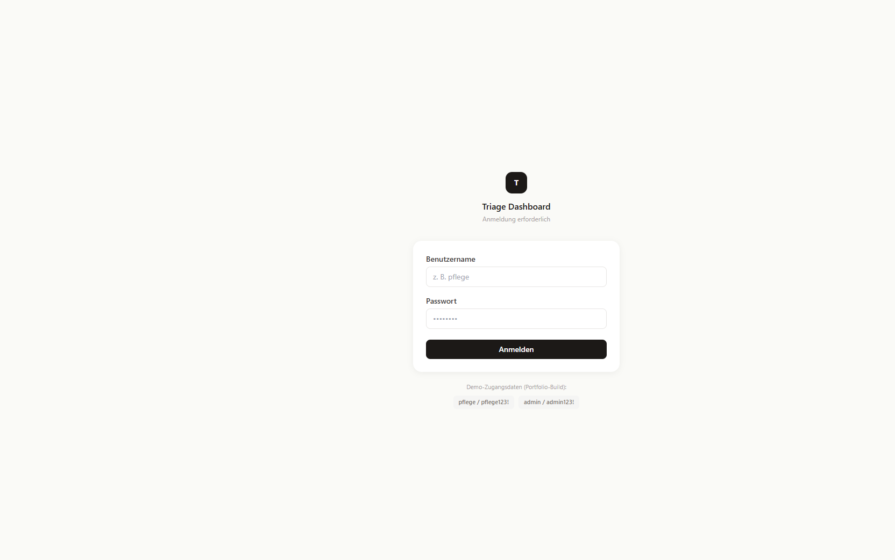
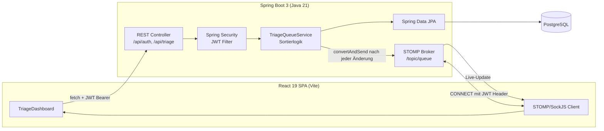

# 🏥 Manchester Triage Dashboard

Echtzeit-Dashboard für die Notaufnahme, das Patient:innen nach dem **Manchester Triage System (MTS)** – dem in Europa etablierten Verfahren zur klinischen Dringlichkeitseinstufung – automatisch priorisiert und live über alle angemeldeten Arbeitsplätze synchronisiert.

Full-Stack-Portfolioprojekt: **Spring Boot 3 / Java 21** Backend mit WebSocket-Push, JWT-Auth und PostgreSQL, **React 19 / Vite / Tailwind** Frontend.

[](https://github.com/<github-user>/<repo-name>/actions/workflows/ci.yml)


---

## Inhalt

- [Screenshots](#screenshots)
- [Warum Manchester Triage?](#warum-manchester-triage)
- [Features](#features)
- [Architektur](#architektur)
- [Tech-Stack](#tech-stack)
- [Lokales Setup](#lokales-setup)
- [Demo-Zugangsdaten](#demo-zugangsdaten)
- [Tests](#tests)
- [CI/CD](#cicd)
- [Deployment (Free Tier)](#deployment-free-tier)
- [Projektstruktur](#projektstruktur)
- [Scope & bewusste Vereinfachungen](#scope--bewusste-vereinfachungen)
- [Lizenz](#lizenz)

---

## Screenshots

| Login | Triage-Warteliste (nach Dringlichkeit sortiert) |
|---|---|
|  |  |

> Screenshots lokal erzeugen: Backend + Frontend starten (siehe [Lokales Setup](#lokales-setup)), einloggen, ein paar Demo-Patient:innen anlegen und die Bilder unter `docs/screenshots/` ablegen.

---

## Warum Manchester Triage?

Das MTS ordnet Patient:innen anhand von Leitsymptomen fünf Dringlichkeitsstufen mit klar definierten **maximalen Wartezeiten** zu:

| Stufe | Bedeutung | Max. Wartezeit |
|---|---|---|
| 🔴 RED | Sofort / Lebensgefahr | 0 Min |
| 🟠 ORANGE | Sehr dringend | 10 Min |
| 🟡 YELLOW | Dringend | 30 Min |
| 🟢 GREEN | Normal | 90 Min |
| 🔵 BLUE | Nicht dringend | 120 Min |

Die App sortiert die Warteliste **streng nach klinischer Dringlichkeit** (Triagestufe), bei Gleichstand nach Ankunftszeit (FIFO) – nicht alphabetisch. Das ist kein Detail: Eine falsch sortierte Notaufnahme-Warteliste ist ein Patientensicherheitsrisiko. Die Sortierlogik lebt bewusst in Java (`TriageQueueService`, siehe Javadoc dort) statt in einem naiven SQL-`ORDER BY`, weil die Triagestufe als String persistiert wird und eine DB-seitige Sortierung sonst alphabetisch (`GREEN` vor `RED`) statt klinisch korrekt wäre. Ein Regressionstest (`getSortedQueue_ordersByClinicalUrgency_notAlphabetically`) sichert das ab.

## Features

- **Echtzeit-Warteliste** – neue Patient:innen, Re-Triagen und Entlassungen werden per WebSocket (STOMP/SockJS) sofort an alle offenen Dashboards gepusht, kein Polling.
- **Klinisch korrekte Priorisierung** – Sortierung nach Triagestufe + Ankunftszeit, inkl. automatisch berechneter Ziel-Behandlungszeit je Stufe.
- **Re-Triage** – Verschlechtert sich der Zustand einer Patientin, kann die Stufe jederzeit angehoben werden; die Zielzeit wird neu berechnet und die Person rückt in der Liste vor.
- **Authentifizierung & Rollen** – JWT-basiertes Login (`STAFF` / `ADMIN`), REST- **und** WebSocket-Verbindungen sind geschützt.
- **Live-Verbindungsstatus** – sichtbare Anzeige, ob die WebSocket-Verbindung aktiv ist (`ConnectionIndicator`).
- **API-Dokumentation** – interaktives Swagger UI unter `/swagger-ui.html`.
- **Health-Checks** – `/actuator/health` für Hosting-Plattformen (Render u. ä.).
- **Datenbank-Migrationen** – versioniert mit Flyway, kein manuelles Schema-Management.

## Architektur



**Request-Flow bei Änderungen:** REST-Call → Persistenz → Neuberechnung der sortierten Queue → WebSocket-Broadcast an `/topic/queue` → alle verbundenen Clients aktualisieren sich ohne Reload.

## Tech-Stack

**Backend**
- Java 21, Spring Boot 3.3 (Web, WebSocket/STOMP, Security, Validation, Data JPA, Actuator)
- PostgreSQL 16 + Flyway (Migrationen)
- JWT (jjwt) für stateless Auth
- Lombok, MapStruct
- springdoc-openapi (Swagger UI)
- JUnit 5, MockMvc, Spring Security Test, H2 (Integrationstests)

**Frontend**
- React 19, Vite, Tailwind CSS
- @stomp/stompjs + sockjs-client für Echtzeit-Updates
- ESLint

**Infra / DevOps**
- Docker (Multi-Stage-Build für das Backend)
- GitHub Actions (CI: Backend-Build/Tests + Frontend-Lint/Build)
- Render (Backend-Hosting, Free Tier) + Neon (Postgres, Free Tier) + Vercel (Frontend-Hosting, Free Tier)

## Lokales Setup

### Voraussetzungen

- Java 21+, Maven
- Node.js 22+
- Docker (für lokale PostgreSQL-Instanz) – alternativ eine lokal installierte Postgres

### 1. Repository klonen

```bash
git clone https://github.com/<github-user>/<repo-name>.git
cd <repo-name>
```

### 2. Datenbank starten

```bash
docker compose up -d
```

Startet PostgreSQL 16 auf Port `5432` mit den in `docker-compose.yml` definierten Zugangsdaten. Läuft bereits ein anderer Postgres-Dienst auf 5432, den Port dort anpassen und `SPRING_DATASOURCE_URL` beim Start entsprechend überschreiben.

### 3. Backend starten

```bash
mvn spring-boot:run
```

Läuft standardmäßig auf `http://localhost:8080`. Beim ersten Start legt Flyway das Schema an und `DemoUserSeeder` erstellt zwei Demo-Konten (siehe unten). API-Docs: `http://localhost:8080/swagger-ui.html`.

### 4. Frontend starten

```bash
cd frontend
npm install
npm run dev
```

Läuft auf `http://localhost:5173` und spricht per Default `http://localhost:8080` an (konfigurierbar über `VITE_API_BASE_URL`, siehe `frontend/.env.example`).

## Demo-Zugangsdaten

| Rolle | Benutzername | Passwort |
|---|---|---|
| Pflegepersonal | `pflege` | `pflege123!` |
| Admin | `admin` | `admin123!` |

Nur für lokale Entwicklung/Demo. In produktiven Deployments werden die Passwörter über `DEMO_STAFF_PASSWORD` / `DEMO_ADMIN_PASSWORD` überschrieben (siehe `render.yaml`).

## Tests

```bash
# Backend: Unit- & Integrationstests (JUnit 5, MockMvc, H2)
mvn test

# Frontend: Linting
cd frontend && npm run lint
```

Die Backend-Testsuite deckt u. a. die klinische Sortierlogik, Authentifizierung/Autorisierung und die REST-Endpunkte ab.

## CI/CD

Jeder Push/PR auf `main` triggert zwei parallele Jobs in GitHub Actions (`.github/workflows/ci.yml`), ausschließlich auf dem kostenlosen `ubuntu-latest`-Runner:

- **Backend** – `mvn verify` mit JDK 21
- **Frontend** – `npm ci`, `npm run lint`, `npm run build` mit Node 22

## Deployment (Free Tier)

Bewusst so konfiguriert, dass die App **ohne laufende Kosten** deploybar ist:

| Komponente | Anbieter | Free-Tier-Hinweis |
|---|---|---|
| Backend (Docker) | [Render](https://render.com) | Free-Web-Service schläft nach Inaktivität ein, kein Kreditkarten-Zwang |
| PostgreSQL | [Neon](https://neon.tech) | Dauerhaft kostenloser Tier (Render's eigene Free-Postgres läuft nach 30 Tagen ab – deshalb bewusst nicht genutzt) |
| Frontend | [Vercel](https://vercel.com) | Kostenloser Hobby-Plan |

**Setup:**

1. Neon-Projekt anlegen → Connection-String kopieren.
2. Auf Render: „New" → „Blueprint" → dieses Repo auswählen (nutzt `render.yaml`). Im Dashboard `SPRING_DATASOURCE_URL/_USERNAME/_PASSWORD` (aus Neon) sowie `CORS_ALLOWED_ORIGINS` (die spätere Vercel-URL) setzen. `JWT_SECRET` wird von Render automatisch generiert.
3. Auf Vercel: Repo importieren, Root-Verzeichnis `frontend`, Env-Var `VITE_API_BASE_URL` auf die Render-Backend-URL setzen.
4. Nach dem ersten Deploy: `CORS_ALLOWED_ORIGINS` in Render auf die finale Vercel-URL aktualisieren.

## Projektstruktur

```
triage-dashboard/
├── src/main/java/de/hospital/triagedashboard/
│   ├── config/          # WebSocket- & Demo-User-Konfiguration
│   ├── controller/      # REST-Endpunkte (Auth, Triage)
│   ├── dto/              # Request-/Response-DTOs
│   ├── mapper/          # MapStruct Entity↔DTO
│   ├── model/            # JPA-Entities & Enums (TriageLevel, Role)
│   ├── repository/       # Spring Data JPA
│   ├── security/         # JWT-Filter, UserDetailsService, STOMP-Auth
│   └── service/          # Kerngeschäftslogik (Sortierung, Re-Triage)
├── src/main/resources/db/migration/  # Flyway-Migrationen
├── frontend/src/
│   ├── components/        # UI-Komponenten (PatientCard, LoginForm, ...)
│   ├── context/           # AuthContext
│   ├── hooks/             # useAuth, useTriageWebSocket
│   ├── pages/              # TriageDashboard
│   └── utils/              # apiClient, authStorage, ...
├── .github/workflows/ci.yml
├── Dockerfile
├── docker-compose.yml
└── render.yaml
```

## Scope & bewusste Vereinfachungen

Dieses Projekt ist als **Portfolio-Showcase** aufgesetzt, nicht als produktionsreifes Klinik-SaaS. Bewusst **nicht** umgesetzt (bzw. für einen echten Klinikbetrieb noch nötig):

- Mandantenfähigkeit (Multi-Tenancy) für mehrere Kliniken
- DSGVO-/MDR-konforme Prozesse (Audit-Trail, Löschkonzept, Betroffenenrechte)
- HL7/FHIR-Anbindung an bestehende Krankenhausinformationssysteme
- OAuth2/OIDC-SSO statt einfacher JWT-Login
- Granulares RBAC über zwei Rollen hinaus

## Lizenz

MIT – siehe [LICENSE](LICENSE).
